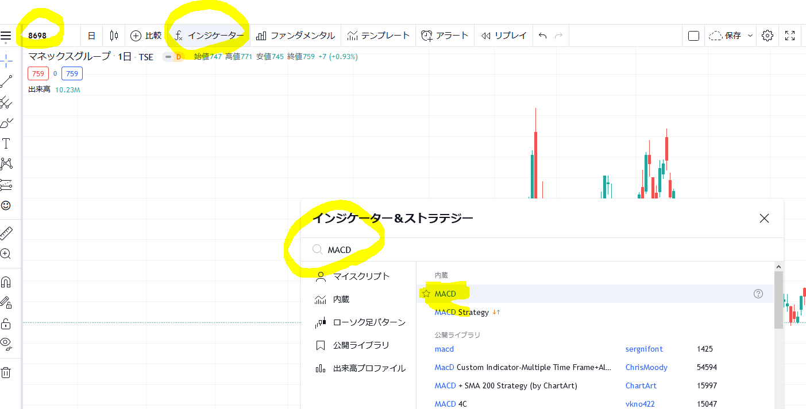
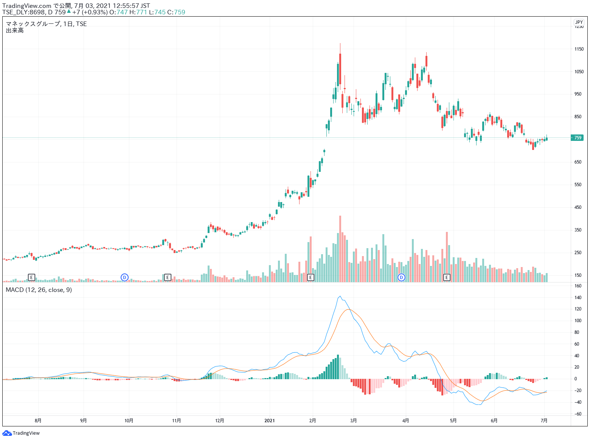
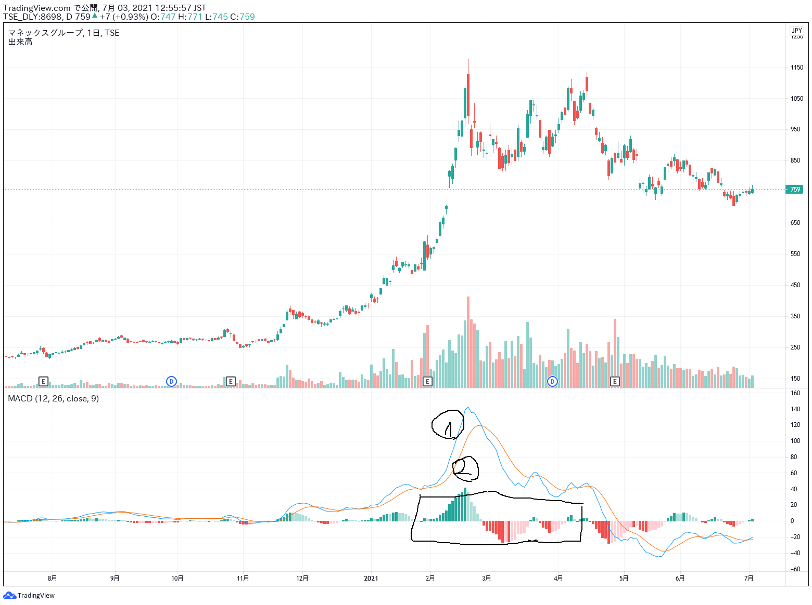
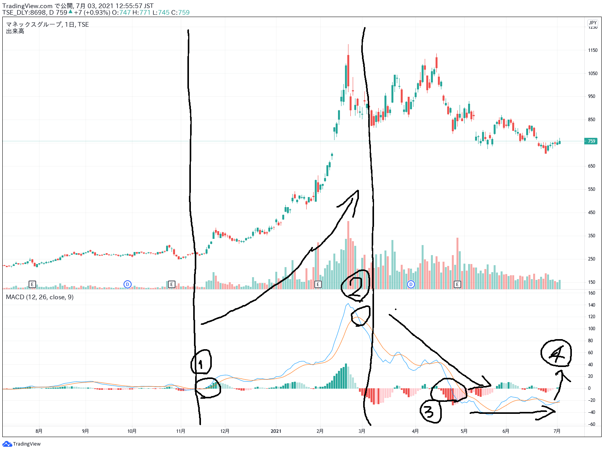

# MACD

- マネックス株価

## MACDの見方

- ①青線 MACD
- ②黄色線　シグナル
- 四角で囲んでいるもの　ヒストグラム（MACDとシグナルの差分）

### 判定
- MACDがシグナルより上　＝　上昇中（ヒストグラムは緑）
- MACDがシグナルより下　＝　下降中（ヒストグラムは赤）
- 0より上にMACD、シグナルがある　＝　上昇中
- 0より下にMACD、シグナルがある　＝　下降中

## 取引例
- ①　MACD、シグナルが0を突き抜けたので買い
- ②　MACDがシグナルより下になったので売り
- ③は今後の様子
  - ヒストグラムが赤より下降フェーズに入っている
  - 基本的にMACDがシグナルより下にある
  - ③　でMACD、シグナルが0を下回ってしまっている
  - 買わないほうがよさそう（株価を見るとこの期間下がってはいないが、上昇・下降を繰り返しているのでどのみち利益は取れない、判定も難しい）
  - 様子見をしても④のようにMACD、シグナルが0を突き抜ければ買ってもいいかも

